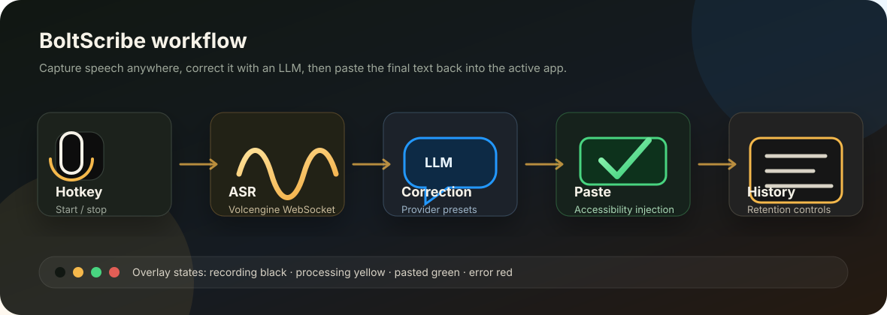
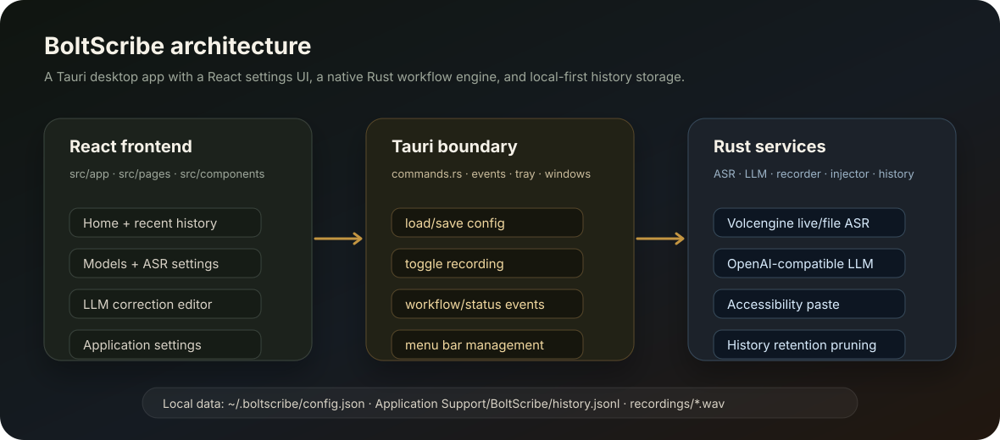

<p align="center">
  
</p>

<h1 align="center">BoltScribe</h1>

<p align="center">
  A small macOS dictation app with global hotkeys, ASR transcription, and optional LLM cleanup.
</p>

<p align="center">
  <a href="README.zh-CN.md">中文 README</a>
  ·
  <a href="#features">Features</a>
  ·
  <a href="#quick-start">Quick Start</a>
</p>



## Overview

BoltScribe is a macOS voice input app. Press a global hotkey to record, press it again to stop, and BoltScribe transcribes your speech, optionally cleans it up with an OpenAI-compatible model, and inserts the result into the active app.

It runs as a lightweight menu bar app, keeps data on your Mac, and provides history, logs, and input statistics for reviewing past dictation.

## Features

- **Hotkey dictation:** start and stop voice input from anywhere on macOS.
- **ASR plus correction:** transcribe speech with Volcengine ASR and optionally refine the text with an LLM.
- **Flexible model setup:** use OpenAI-compatible providers, save model presets, and run multi-model race mode.
- **Local history:** review previous recordings, transcripts, corrected text, logs, and input statistics.
- **Menu bar workflow:** keep BoltScribe in the background with quick access to settings and correction controls.
- **Bilingual interface:** switch between Chinese and English.

## Architecture



BoltScribe is built with Tauri, React, TypeScript, and Rust. The React frontend lives in `src`; the Tauri backend lives in `src-tauri/src`.

## Quick Start

### Requirements

- macOS 11 or later.
- Node.js and npm.
- Rust toolchain.
- Tauri build prerequisites for macOS.
- Volcengine ASR credentials.
- An OpenAI-compatible LLM endpoint and API key if LLM correction is enabled.

### Install Dependencies

```bash
npm install
```

### Run In Development

```bash
npm run tauri dev
```

### Build A Release Bundle

```bash
npm run tauri build
```

The macOS app bundle and DMG are generated under:

```text
src-tauri/target/release/bundle/
```

## Configuration

BoltScribe stores user configuration in:

```text
~/.boltscribe/config.json
```

The repository includes starter configuration files:

```text
config.default.json
config.example.json
```

Configuration covers ASR, LLM providers, correction templates, language, overlay position, history retention, and system integration.

## Permissions

BoltScribe needs Microphone permission to record speech and Accessibility permission to insert text into the active app.

## Local Data

Runtime data stays on the local machine:

```text
~/Library/Application Support/BoltScribe/history.jsonl
~/Library/Application Support/BoltScribe/recordings/
```

History retention defaults to:

- at most 500 records;
- at most 2 GB of recorded audio/history storage.

## Development

Common checks:

```bash
npm run build
cargo test --manifest-path src-tauri/Cargo.toml
cargo clippy --manifest-path src-tauri/Cargo.toml -- -D warnings
cargo fmt --manifest-path src-tauri/Cargo.toml -- --check
```

## License

BoltScribe is licensed under the Creative Commons Attribution-NonCommercial 4.0 International License. Commercial use is not permitted.
