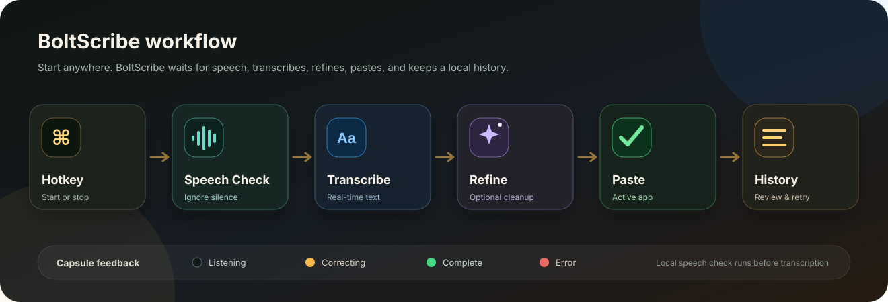
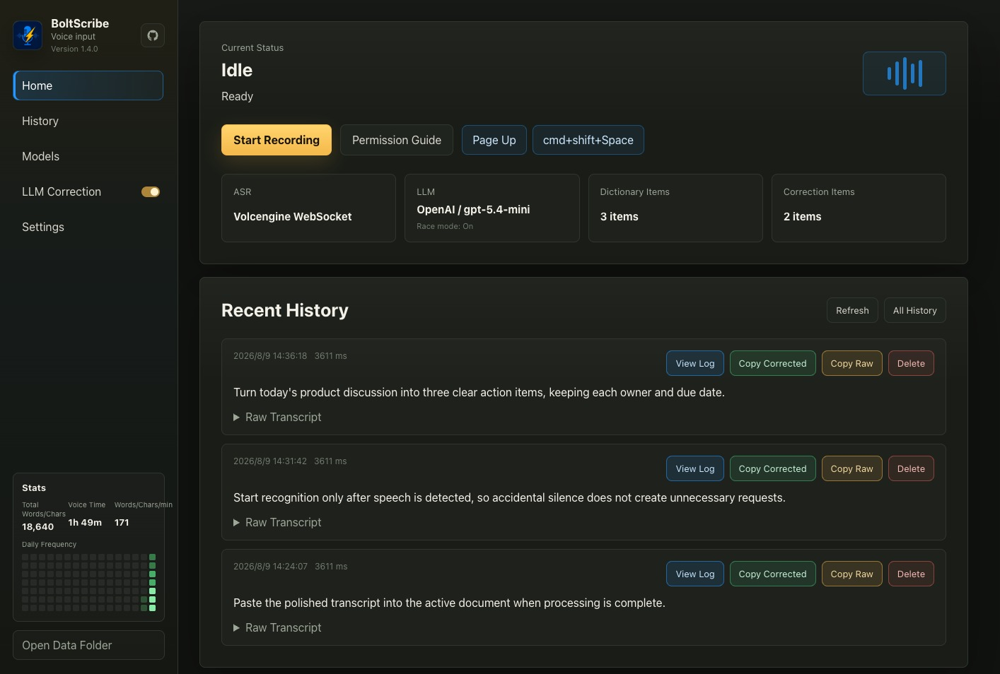

  

<h1 align="center">BoltScribe</h1>

  A focused macOS and Windows dictation app with global hotkeys, real-time transcription, and optional AI text cleanup.

  <a href="README.zh-CN.md">中文 README</a>
  ·
  <a href="https://github.com/OneChirpZ/BoltScribe/releases/tag/v1.5.0">Latest Release</a>
  ·
  <a href="#features">Features</a>
  ·
  <a href="#quick-start">Quick Start</a>

## Overview

BoltScribe turns speech into ready-to-use text from anywhere on your desktop. Press a global hotkey to begin, press it again to finish, and the result is transcribed, optionally polished, and pasted into the active app.

It stays quietly in the menu bar or system tray, provides clear recording feedback, and keeps a searchable local history with input statistics.

## Screenshots

  
  
  

Listening · Text cleanup · Completed

## Features

- **Dictate from anywhere:** start and stop voice input with global hotkeys or the menu bar/system tray.
- **Real-time transcription:** see a continuous listening state, with automatic recovery and recorded-audio fallback when the live service is interrupted.
- **No-speech protection (Beta, off by default):** recognition starts only after speech is confirmed, helping avoid unnecessary requests after accidental activation. Detection thresholds and waiting time are adjustable, with a local microphone test that does not call ASR.
- **Optional text cleanup:** improve punctuation, phrasing, and terminology with configurable AI models, personal dictionaries, correction rules, and optional multi-model racing.
- **Reliable audio input:** prioritize preferred microphones, block unsuitable devices, and automatically try another input when capture fails.
- **Clear recording feedback:** follow waiting, listening, processing, and completion states through the compact capsule and live waveform.
- **Comfortable recording:** optionally lower or mute other audio while dictating, then restore it automatically.
- **History and retry:** review transcripts, recordings, processing logs, input statistics, and retry a failed item from history.
- **Local data control:** choose where history and recordings are stored, set retention limits, and clean up old audio from the app.
- **Bilingual desktop app:** use BoltScribe in Chinese or English on macOS and Windows.

## Quick Start

### Download

The latest public release is [BoltScribe v1.5.0](https://github.com/OneChirpZ/BoltScribe/releases/tag/v1.5.0).

Available downloads:

- macOS Apple Silicon: `BoltScribe_1.5.0_aarch64.dmg`

The v1.5.0 release does not include a new Windows installer yet.

### Requirements

- Supported platforms: macOS 11 or later, or Windows 10/11.
- Volcengine ASR credentials for transcription.
- An OpenAI-compatible model and API key only if text cleanup is enabled.

After installation:

1. Grant microphone permission. On macOS, also grant Accessibility permission so BoltScribe can paste text into the active app.
2. Add your transcription credentials and, if desired, configure an AI model for text cleanup.
3. Choose your hotkeys, microphone, and no-speech protection settings.
4. Press the hotkey to dictate, then press it again to stop and paste the result.

## Everyday Settings

BoltScribe lets you adjust transcription language, AI models, dictionaries, correction rules, microphone priority, no-speech protection, overlay size and position, output volume behavior, history retention, and launch options from the app.

## Permissions

BoltScribe needs Microphone permission to record speech. On macOS, it also needs Accessibility permission to insert text into the active app. On Windows, text insertion uses the clipboard and a synthetic paste shortcut.

## Privacy and Local Data

History, recordings, settings, and input statistics remain on your device. You can move the data folder and control retention from Settings. Speech and text are sent only to the transcription and text-cleanup services you configure; the local microphone sensitivity test does not use either service.

## License

BoltScribe is licensed under the Creative Commons Attribution-NonCommercial 4.0 International License. Commercial use is not permitted.
