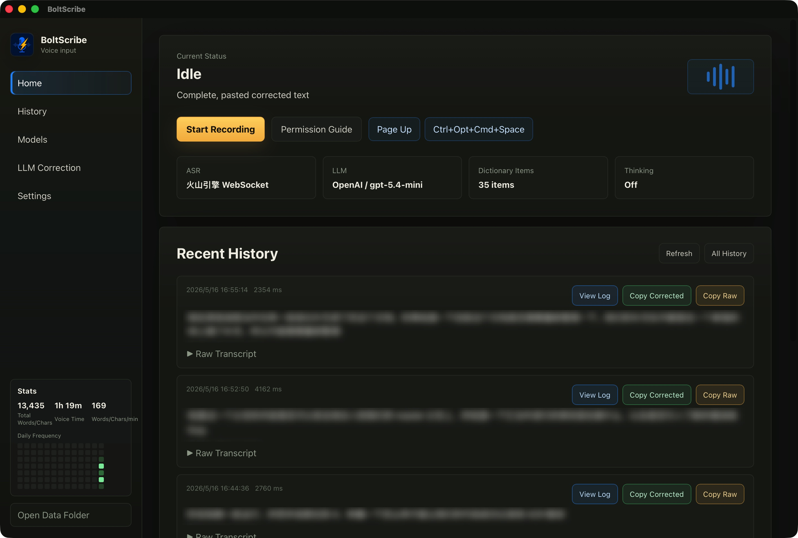
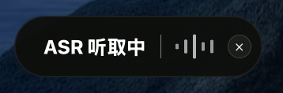

<p align="center">
  
</p>

<h1 align="center">BoltScribe</h1>

<p align="center">
  A small macOS and Windows dictation app with global hotkeys, ASR transcription, and optional LLM cleanup.
</p>

<p align="center">
  <a href="README.zh-CN.md">中文 README</a>
  ·
  <a href="#features">Features</a>
  ·
  <a href="#quick-start">Quick Start</a>
</p>


## Overview

BoltScribe is a desktop voice input app for macOS and Windows. Press a global hotkey to record, press it again to stop, and BoltScribe transcribes your speech, optionally cleans it up with an OpenAI-compatible model, and inserts the result into the active app.

It runs as a lightweight tray/menu bar app, keeps data on your machine, and provides history, logs, and input statistics for reviewing past dictation.

## Screenshots





## Features

- **Hotkey dictation:** start and stop voice input from anywhere on macOS or Windows.
- **ASR plus correction:** transcribe speech with Volcengine ASR and optionally refine the text with an LLM.
- **Flexible model setup:** use OpenAI-compatible providers, save model presets, and run multi-model race mode.
- **Local history:** review previous recordings, transcripts, corrected text, logs, and input statistics.
- **Tray workflow:** keep BoltScribe in the background with quick access to settings and correction controls.
- **Bilingual interface:** switch between Chinese and English.

## Architecture


BoltScribe is built with Tauri, React, TypeScript, and Rust. The React frontend lives in `src`; the Tauri backend lives in `src-tauri/src`.

## Quick Start

### Requirements

- Supported platforms: macOS 11 or later, or Windows 10/11.
- Node.js and npm.
- Rust toolchain.
- Tauri build prerequisites for your platform.
- Windows builds require WebView2 Runtime and Visual Studio 2022 Build Tools with the C++ workload.
- Volcengine ASR credentials.
- An OpenAI-compatible LLM endpoint and API key if LLM correction is enabled.

### Install Dependencies

```bash
npm install
```

### Run In Development

```bash
npm run tauri dev
```

### Build A Release Bundle

```bash
npm run tauri build
```

Release bundles are generated under:

```text
src-tauri/target/release/bundle/
```

## Configuration

BoltScribe stores user configuration in:

```text
~/.boltscribe/config.json
```

The repository includes starter configuration files:

```text
config.default.json
config.example.json
```

Configuration covers ASR, LLM providers, correction templates, language, audio input device selection, overlay position, history retention, and system integration.

Mouse-button shortcuts are available on Windows. On macOS, use keyboard global shortcuts.

Output volume ducking is available on macOS for output devices that expose system volume or mute controls. For devices controlled by Rogue Amoeba SoundSource, enable the SoundSource enhancement and provide two Shortcuts named `BoltScribe SoundSource Duck` and `BoltScribe SoundSource Restore`. The duck shortcut receives JSON text with `action`, `source_name`, `device_name`, `reduction_percent`, and `restore_shortcut`, and should return JSON text like `{"applied":true,"restore_payload":{...}}`. The restore shortcut receives that `restore_payload`; it should only restore when the current SoundSource state still matches the temporary state set by the duck shortcut.

## Permissions

BoltScribe needs Microphone permission to record speech. On macOS, it also needs Accessibility permission to insert text into the active app. On Windows, text insertion uses the clipboard and a synthetic paste shortcut.

## Local Data

Runtime data stays on the local machine:

```text
~/Library/Application Support/BoltScribe/history.jsonl
~/Library/Application Support/BoltScribe/recordings/
%APPDATA%\BoltScribe\history.jsonl
%APPDATA%\BoltScribe\recordings\
```

History retention defaults to:

- at most 500 records;
- at most 2 GB of recorded audio/history storage.

## Development

Common checks:

```bash
npm run build
cargo test --manifest-path src-tauri/Cargo.toml
cargo clippy --manifest-path src-tauri/Cargo.toml -- -D warnings
cargo fmt --manifest-path src-tauri/Cargo.toml -- --check
```

## License

BoltScribe is licensed under the Creative Commons Attribution-NonCommercial 4.0 International License. Commercial use is not permitted.
