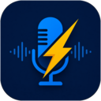
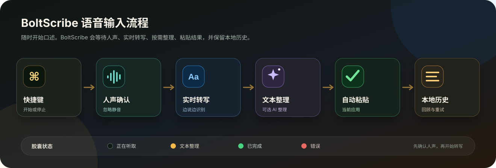
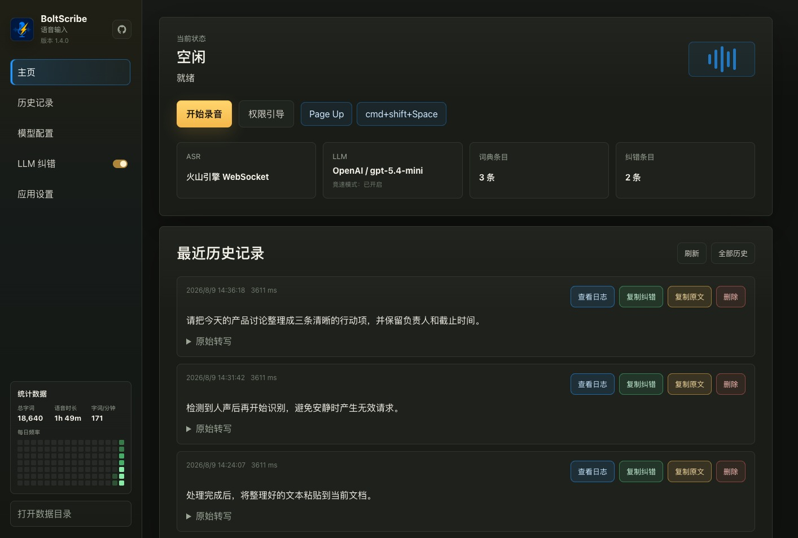

  

<h1 align="center">BoltScribe</h1>

  一个专注的 macOS 和 Windows 语音输入工具，支持全局快捷键、实时转写和可选的 AI 文本整理。

  <a href="README.md">English README</a>
  ·
  <a href="https://github.com/OneChirpZ/BoltScribe/releases/tag/v1.4.1">最新发布</a>
  ·
  <a href="#功能亮点">功能亮点</a>
  ·
  <a href="#快速开始">快速开始</a>

## 项目简介

BoltScribe 可以在桌面任意位置把语音变成可直接使用的文本。按下全局快捷键开始，再次按下结束；应用会完成转写，按需整理文本，并把结果粘贴到当前应用。

它安静地常驻菜单栏或系统托盘，通过清晰的录音反馈展示处理进度，并在本机保留可回顾的历史记录和输入统计。

## 界面示例

  
  
  

正在听取 · 文本整理 · 粘贴完成

## 功能亮点

- **随处语音输入：** 通过全局快捷键或菜单栏/系统托盘开始和结束输入。
- **实时语音转写：** 持续展示听取状态；实时服务中断时可自动恢复，并在需要时使用录音文件继续识别。
- **无人声保护（Beta，默认关闭）：** 确认检测到人声后才开始识别，减少误触后产生的无效请求。检测门槛和等待时间可以调节，并提供完全在本地运行、不调用 ASR 的麦克风测试。
- **可选文本整理：** 通过可配置的 AI 模型改善标点、表达和术语，支持个人词典、易错词规则和可选的多模型竞速。
- **可靠音频输入：** 可以设置麦克风优先级、屏蔽不合适的设备，并在采集失败时自动尝试其他输入设备。
- **清晰录音反馈：** 通过紧凑胶囊和实时波形查看等待说话、正在听取、处理中和完成状态。
- **舒适录音体验：** 录音时可自动降低或静音其他声音，结束后恢复原音量。
- **历史与重试：** 查看转写、录音、处理日志和输入统计，并可从历史记录重新处理失败项目。
- **本地数据管理：** 自定义历史与录音的保存位置、保留上限，并在应用内清理旧录音。
- **双语桌面应用：** 在 macOS 和 Windows 上使用中文或英文界面。

## 快速开始

### 下载

最新公开版本是 [BoltScribe v1.4.1](https://github.com/OneChirpZ/BoltScribe/releases/tag/v1.4.1)。

当前可下载版本：

- macOS Apple Silicon：`BoltScribe_1.4.1_aarch64.dmg`
- Windows x64：`BoltScribe_1.4.1_x64-setup.exe`

### 环境要求

- 支持平台：macOS 11 或更新版本，或 Windows 10/11。
- 用于语音转写的火山引擎 ASR 配置。
- 仅在启用文本整理时需要 OpenAI 兼容模型和 API Key。

安装后：

1. 授予麦克风权限；macOS 还需要辅助功能权限，以便把文本粘贴到当前应用。
2. 填写语音转写配置，并按需配置用于文本整理的 AI 模型。
3. 选择快捷键、麦克风和无人声保护设置。
4. 按快捷键开始口述，再次按下即可停止并粘贴结果。

## 日常设置

可以直接在应用中调整转写语言、AI 模型、词典、易错词规则、麦克风优先级、无人声保护、浮窗大小与位置、输出音量行为、历史保留和启动选项。

## 权限

BoltScribe 需要麦克风权限来录音。在 macOS 上，它还需要辅助功能权限来把文本写入当前应用；在 Windows 上，文本写入使用剪贴板和模拟粘贴快捷键。

## 隐私与本地数据

历史、录音、设置和输入统计保存在本机。可以在设置中移动数据目录并控制保留范围。语音和文本只会发送给你配置的转写与文本整理服务；本地麦克风灵敏度测试不会调用这些服务。

## 许可证

BoltScribe 使用 Creative Commons Attribution-NonCommercial 4.0 International License。该协议不允许商业使用。
