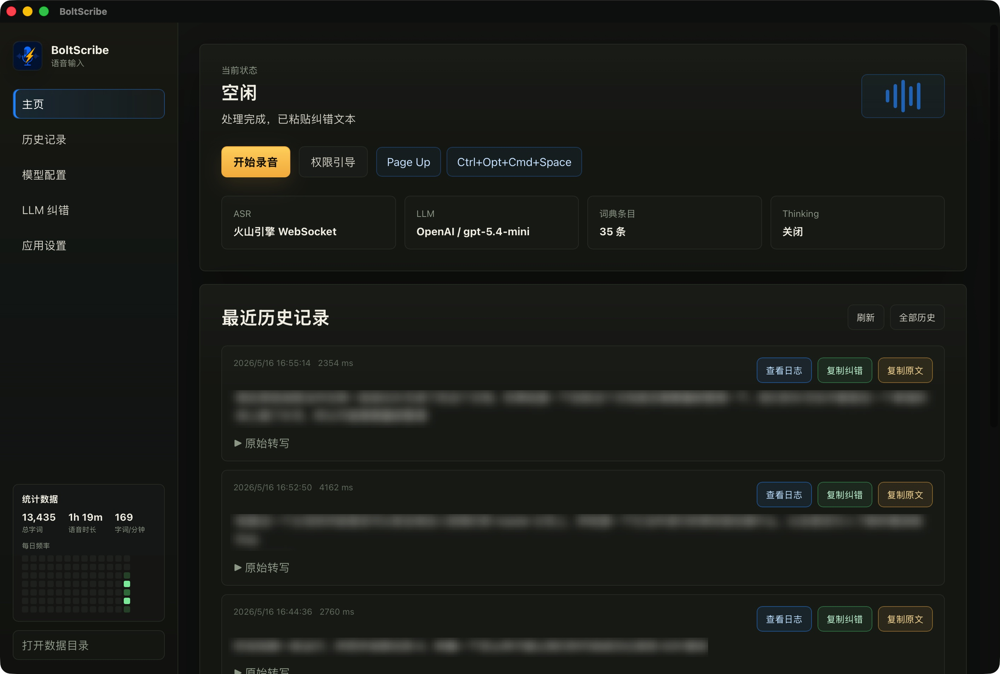

<p align="center">
  
</p>

<h1 align="center">BoltScribe</h1>

<p align="center">
  一个简洁的 macOS 和 Windows 语音输入工具，支持全局快捷键、ASR 转写和可选的 LLM 纠错。
</p>

<p align="center">
  <a href="README.md">English README</a>
  ·
  <a href="https://github.com/OneChirpZ/BoltScribe/releases/tag/v1.2.1">最新发布</a>
  ·
  <a href="#功能亮点">功能亮点</a>
  ·
  <a href="#快速开始">快速开始</a>
</p>


## 项目简介

BoltScribe 是一个 macOS 和 Windows 语音输入应用。按下全局快捷键开始录音，再次按下结束录音；BoltScribe 会完成语音转写，按需用 OpenAI 兼容模型整理文本，并把结果写入当前应用。

它以托盘/菜单栏应用的方式常驻后台，数据保存在本机，并提供历史记录、日志和输入统计。

## 界面示例




## 功能亮点

- **快捷语音输入：** 在 macOS 或 Windows 任意位置通过全局快捷键开始和结束输入。
- **ASR 与纠错：** 使用火山引擎 ASR 转写，并可通过 LLM 整理文本。
- **灵活模型配置：** 支持 OpenAI 兼容服务商、模型预设和多模型竞速。
- **本地历史记录：** 可查看录音、原始转写、纠错结果、日志和输入统计。
- **托盘/菜单栏工作流：** 常驻后台，可从托盘菜单开始/停止语音输入，并可在 Windows 上开启单击托盘录音。
- **可迁移本地数据目录：** 可保留默认本地数据目录，也可在设置中把历史、统计和录音迁移到自定义空目录。
- **更快的胶囊浮窗：** macOS 上不再通过慢速 focused element 查询定位录音胶囊。
- **中英文界面：** 支持中文和英文界面切换。

## 架构


BoltScribe 使用 Tauri、React、TypeScript 和 Rust 构建。React 前端位于 `src`，Tauri 后端位于 `src-tauri/src`。

## 快速开始

### 下载

最新公开版本是 [BoltScribe v1.2.1](https://github.com/OneChirpZ/BoltScribe/releases/tag/v1.2.1)。

当前发布产物：

- macOS Apple Silicon：`BoltScribe_1.2.1_aarch64.dmg`

### 环境要求

- 支持平台：macOS 11 或更新版本，或 Windows 10/11。
- Node.js 和 npm。
- Rust toolchain。
- 当前平台的 Tauri 构建环境。
- Windows 构建需要 WebView2 Runtime 和带 C++ 工作负载的 Visual Studio 2022 Build Tools。
- 火山引擎 ASR 配置。
- 如果启用 LLM 纠错，需要 OpenAI 兼容的大模型接口和 API Key。

### 安装依赖

```bash
npm install
```

### 开发运行

```bash
npm run tauri dev
```

### 构建发布包

```bash
npm run tauri build
```

构建产物位于：

```text
src-tauri/target/release/bundle/
```

打公开发布包前请先运行：

```bash
npm run version:check
```

## 配置

BoltScribe 的用户配置保存在：

```text
~/.boltscribe/config.json
```

仓库中提供了默认配置和示例配置：

```text
config.default.json
config.example.json
```

配置内容包括 ASR、LLM 服务商、纠错模板、界面语言、音频输入设备选择、浮窗位置、历史记录保留策略和系统集成选项。

鼠标按键快捷键仅在 Windows 上可用。macOS 上请使用键盘全局快捷键。

## 权限

BoltScribe 需要麦克风权限来录音。在 macOS 上，它还需要辅助功能权限来把文本写入当前应用；在 Windows 上，文本写入使用剪贴板和模拟粘贴快捷键。

## 本地数据

运行数据保存在本机：

```text
~/Library/Application Support/BoltScribe/history.jsonl
~/Library/Application Support/BoltScribe/input_stats.jsonl
~/Library/Application Support/BoltScribe/recordings/
%APPDATA%\BoltScribe\history.jsonl
%APPDATA%\BoltScribe\input_stats.jsonl
%APPDATA%\BoltScribe\recordings\
```

可以在设置中移动数据目录。BoltScribe 会把现有历史、输入统计和录音迁移到选中的空目录，并把自定义目录指针保存在：

```text
~/.boltscribe/data_dir.txt
```

默认保留策略：

- 最多 500 条历史记录；
- 最多 2 GB 录音和历史存储。

## 开发

常用检查命令：

```bash
npm run build
cargo test --manifest-path src-tauri/Cargo.toml
cargo clippy --manifest-path src-tauri/Cargo.toml -- -D warnings
cargo fmt --manifest-path src-tauri/Cargo.toml -- --check
```

## 许可证

BoltScribe 使用 Creative Commons Attribution-NonCommercial 4.0 International License。该协议不允许商业使用。
